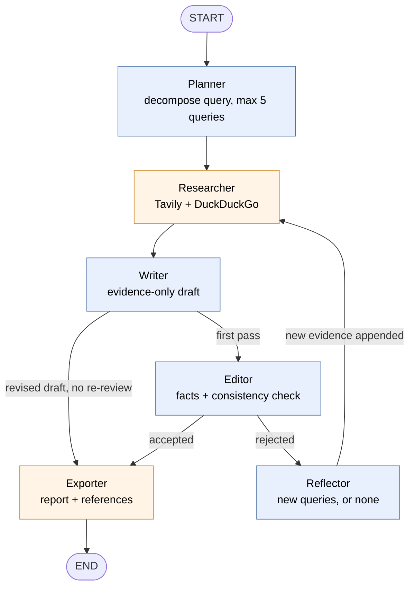

# PicScout

**A lightweight, moderate-depth search agent that runs on a small (~1.7B parameter) local model, on a plain CPU or with a GPU if you have one.**

PicScout takes a question, breaks it into a few focused web searches, gathers evidence, writes an evidence-grounded report, has it reviewed once, and saves the result as a Markdown file with a References list. It is deliberately **not** a deep-research system. The goal is a focused, factual, well-scoped answer that can run entirely on your own machine, or be dropped into a larger project as a sub-graph or a tool.

---

## Highlights

- **Small local model, no GPU required.** Built and tested with `Qwen3-1.7B-Q8_0.gguf` served by `llama.cpp` (`llama-server`) on CPU.
- **Moderate by design.** At most 5 search queries per question, one review pass, at most one revision.
- **Evidence-only writing.** The writer may use only the retrieved sources. Anything the sources don't cover is written as `Not provided in search results.`
- **References built in code, not by the model.** The list at the bottom of every report comes straight from the sources the writer actually saw, so titles and URLs can't be mangled or invented.
- **Bounded loop.** A reviewer checks the draft once. If it finds a problem, the agent fixes it once, then exports.
- **Model-agnostic.** Talks to any OpenAI-compatible endpoint, so you can switch to a bigger local or hosted model by changing environment variables.
- **Easy to embed.** A compiled LangGraph you can call from Python, wrap as a LangChain tool, or mount inside a parent graph.

---

## How it works



### The nodes

| Node | Uses the LLM? | What it does |
|---|---|---|
| **Planner** | Yes | Turns the question into 1 to 5 search queries. For comparisons it names the entities and writes one query per entity that bundles all the attributes, instead of one query per attribute. A small code check guarantees every named entity gets at least one query. |
| **Researcher** | No | Runs each query against Tavily (primary) and DuckDuckGo (supplement), tags every result with the query that produced it, removes duplicates and very short snippets. |
| **Writer** | Yes | Writes the report using only the retrieved sources. Keeps the top evidence by relevance score and caps per-source length so the prompt stays small. |
| **Editor** | Yes | Reviews the draft once for (1) specific facts rather than filler and (2) internal consistency, such as a claim contradicting another or a fact filed under the wrong entity. |
| **Reflector** | Yes | Only runs if the editor rejects the draft. If the feedback names missing information, it proposes 1 to 2 new queries. If the problem is a writing error (contradiction, wrong attribution), it returns nothing and no search is run. |
| **Exporter** | No | Assembles the final Markdown, appends the References section and an editor note, and writes it to `outputs/`. |

### The revision loop, precisely

1. The writer produces a first draft and the editor reviews it.
2. **Accepted:** export.
3. **Rejected:** the reflector decides whether a search would help. New evidence, if any, is *appended* to the existing evidence (state reducer `operator.add`, nothing is overwritten).
4. The writer revises the previous draft against the feedback. New evidence is guaranteed a place in the prompt, and older evidence is shortened because its facts are already in the draft.
5. The revised draft goes straight to export. It is **not** reviewed a second time.

This keeps the number of LLM calls small and the run time predictable.

---

## What a report looks like

Reports are saved as `outputs/report_<query>_<timestamp>.md`:

```markdown
# Research Report: <your question>

<one direct sentence answering the question>

<supporting details drawn only from the retrieved sources; gaps are written as
"Not provided in search results.">

## References

- [Source title](https://...)
- [Another source](https://...)

---
*Editor verdict: ✅ Accepted — Looks good.*
```

- The References list contains exactly the sources the writer had in front of it for the final draft (deduplicated by URL).
- If a revision happened, the footer says so instead of showing a stale verdict.

---

## Why it works on a small model

A 1.7B model is not asked to do open-ended research. Every step is narrowed so a small model can do it reliably, and anything that must be *correct* is done in ordinary code:

| Risk with small models | How PicScout handles it |
|---|---|
| Planning explodes into dozens of queries | Hard cap of 5; one query per entity; deterministic entity-coverage check |
| Inventing facts | Evidence-only prompt, explicit "Not provided in search results." fallback, no citation formatting demanded from the model |
| Context overflow | Evidence trimmed to the top items, each source clipped; worst-case prompt is roughly half of a 10k context |
| Fragile formatting | JSON and verdict parsing with regex, `<think>` blocks stripped defensively, safe fallbacks on every parse |
| Endless loops | Structurally capped at one revision, and the revised draft always exports |
| Wrong references | Built from data, never generated |

Qwen3's hybrid reasoning mode is used selectively: judgment-heavy steps (planning, reviewing) can reason, while mechanical steps (writing from evidence, proposing queries) run in `/no_think` mode for speed and to avoid the model rationalizing unsupported claims.

---

## Quickstart

### Requirements

- Python 3.11+ and [`uv`](https://docs.astral.sh/uv/) (or plain `pip`)
- [`llama.cpp`](https://github.com/ggml-org/llama.cpp) `llama-server` (a recent build)
- `Qwen3-1.7B-Q8_0.gguf`
- A [Tavily](https://tavily.com) API key

### Install

```bash
git clone <your-repo-url>
cd <your-repo>
uv sync            # or: pip install langgraph langchain-openai tavily-python ddgs wikipedia arxiv python-dotenv
```

### Configure

Create a `.env` file in the project root:

```env
TAVILY_API_KEY=your_tavily_key

# Local llama-server (OpenAI-compatible)
OPENAI_API_BASE=http://localhost:8000/v1
OPENAI_API_KEY=local-key
MODEL_NAME=local_model
```

### Start the local model server

Windows:

```powershell
llama-server.exe -m "Qwen3-1.7B-Q8_0.gguf" -c 10000 --port 8000 --jinja --device none --temp 0.3 --top-p 0.8 --top-k 20 --repeat-penalty 1.1
```

Linux / macOS:

```bash
./llama-server -m Qwen3-1.7B-Q8_0.gguf -c 10000 --port 8000 --jinja --temp 0.3 --top-p 0.8 --top-k 20 --repeat-penalty 1.1
```

| Flag | Why |
|---|---|
| `--jinja` | **Required.** Applies the model's real chat template so Qwen3's `/no_think` switch and reasoning output are handled correctly. |
| `-c 10000` | Context window. Enough headroom for the largest prompt PicScout builds. |
| `--device none` | Forces CPU-only inference (Windows build example). Drop it if you have a GPU build and want to offload layers. |
| `--temp 0.3 --top-p 0.8 --top-k 20 --repeat-penalty 1.1` | Non-greedy sampling defaults. Pure greedy decoding (temperature 0) can cause repetition loops in small quantized models. |
| `--port 8000` | Matches the default `OPENAI_API_BASE`. |

### Run

```bash
uv run python main.py
```

Enter a research question when prompted. Progress is printed per node, and the finished report is saved under `outputs/`.

---

## Running on CPU

PicScout needs no GPU. Q8_0 quantization of a 1.7B model is small enough for ordinary laptops and desktops, and the pipeline is built around that constraint:

- Only the writer produces long output; planner, reflector and editor produce short structured answers.
- Prompts are kept small on purpose (see the context table above).
- The heaviest non-LLM cost is the web search, not the model.

**CPU is slower than GPU.** Running on CPU makes PicScout accessible (no GPU, no API bill, everything local), but a full run takes noticeably longer than the same model on a GPU. Total time depends on your CPU, thread count, how much the planner and editor reason, and whether a question triggers a revision.

Ways to speed it up:

- Use a GPU build and remove `--device none` (add `-ngl 99` to offload all layers).
- Try a `Q4_K_M` quant instead of `Q8_0`. It is smaller and usually faster on CPU, with a small quality cost.
- Set the thread count with `-t` to match your physical cores.
- Turn off reasoning for the planner and editor (`/no_think`) and lower the `max_tokens` of each node.
- Reduce the evidence kept by the writer (fewer items or fewer characters per source).

To find where the time goes, wrap each node in a timer and read the per-node seconds in the terminal.

---

## Switching to a bigger model

Nothing in the code is tied to one model. `src/llm.py` talks to any OpenAI-compatible endpoint, so switching is a configuration change.

**A larger local model (llama.cpp, vLLM, LM Studio, Ollama):**

```env
OPENAI_API_BASE=http://localhost:8000/v1      # or http://localhost:11434/v1 for Ollama
MODEL_NAME=your-model-name
```

**A hosted API:**

```env
OPENAI_API_BASE=https://api.openai.com/v1
OPENAI_API_KEY=sk-...
MODEL_NAME=<model id>
```

Things to check when you switch:

1. **`/no_think` is Qwen3-specific.** It is the soft switch for Qwen3 *hybrid* models. Other model families just see it as text, so remove it or leave it, it does nothing.
2. **Thinking-only models ignore it.** Models such as `Qwen3-4B-Thinking-2507` always reason. If you use one, raise `max_tokens` on every node (planner, writer, editor and reflector budgets were sized for short answers) and expect noticeably slower runs on CPU.
3. **Sampling extras.** `src/llm.py` sends `top_k` and `repetition_penalty` through `extra_body`. llama.cpp and vLLM accept these; some hosted APIs reject unknown parameters, so remove `extra_body` for those.
4. **Context size.** If your model supports a larger window, you can raise the evidence limits in the writer (items kept and characters per source) for richer reports.
5. **A hybrid setup is possible:** point only the writer at a stronger model and keep the rest on the small local one, by giving `get_llm()` a per-node endpoint.

---

## Integrating PicScout into another system

### 1. Call it from Python

```python
from src.graph import build_graph

def run_picscout(query: str) -> dict:
    graph = build_graph()
    state = graph.invoke({
        "original_query": query,
        "search_queries": [],
        "raw_research_data": [],
        "draft_content": "",
        "feedback": "",
        "revision_count": 0,
        "is_acceptable": False,
        "final_output_path": "",
        "cited_evidence": [],
        "entities": [],
    })
    return {
        "report": state["draft_content"],
        "sources": state["cited_evidence"],
        "path": state["final_output_path"],
    }
```

The exporter writes a Markdown file to `outputs/` as a side effect. If you embed PicScout and don't want files, remove the exporter node or change its output path.

### 2. Use it as a node in a parent LangGraph

```python
def picscout_node(state):
    result = run_picscout(state["question"])
    return {"research_report": result["report"], "research_sources": result["sources"]}

parent.add_node("picscout", picscout_node)
```

Wrapping it in a function keeps PicScout's internal state separate from the parent graph's schema.

### 3. Expose it as a tool for another agent

```python
from langchain_core.tools import tool

@tool
def picscout_search(question: str) -> str:
    """Search the web and return a short, evidence-grounded report with references."""
    result = run_picscout(question)
    refs = "\n".join(f"- {s.get('title')} ({s.get('url')})" for s in result["sources"])
    return f"{result['report']}\n\nSources:\n{refs}"
```

### 4. Stream progress

```python
for event in graph.stream(initial_state, stream_mode="updates"):
    for node_name, output in event.items():
        print("completed:", node_name)
```

`stream_mode="updates"` is required for the `{node_name: output}` event shape. The default mode returns the full state each step.

---

## Project structure

```
.
├── main.py                  # CLI entry point
├── src/
│   ├── graph.py             # graph wiring, researcher and exporter nodes, routing
│   ├── state.py             # ResearchState schema
│   ├── llm.py               # OpenAI-compatible LLM client factory
│   ├── tools.py             # Tavily, DuckDuckGo, Wikipedia, arXiv search + evidence cleanup
│   └── agents/
│       ├── planner.py
│       ├── writer.py
│       ├── editor.py
│       └── reflector.py
└── outputs/                 # generated reports
```

### State reference

| Key | Type | Notes |
|---|---|---|
| `original_query` | str | The user question |
| `search_queries` | list[str] | Overwritten each planner or reflector pass |
| `raw_research_data` | list[dict] | **Accumulates** across passes (`operator.add`) |
| `entities` | list[str] | Compared subjects named by the planner |
| `draft_content` | str | Current draft |
| `cited_evidence` | list[dict] | Exact sources the writer used, drives the References list |
| `feedback` | str | Editor feedback |
| `is_acceptable` | bool | Editor verdict |
| `revision_count` | int | 0 on the first writer pass, set to 1 by the editor |
| `final_output_path` | str | Path of the exported report |

Every key a node returns must be declared in `ResearchState`. LangGraph silently drops undeclared keys.

---

## Search sources

- **Tavily** (advanced depth) is the primary source and provides most of the evidence.
- **DuckDuckGo** (`ddgs`) is a best-effort supplement. It is unofficial and rate-limited, so results are sometimes empty.
- **Wikipedia** and **arXiv** helpers are included in `src/tools.py` and can be enabled in `research_one_query` for encyclopedic or research-paper topics.

---

## Example questions that suit PicScout

- How does ChromaDB work?
- What is Model Context Protocol (MCP) and how is it used with LLM agents?
- Compare FastAPI and Flask for building REST APIs
- Compare Qdrant, Chroma, and Weaviate: ease of setup, metadata filtering, and licensing
- What is new in Python 3.14?

---

## Limitations

PicScout trades depth for speed and locality. Be aware of:

- **Small models can still mix up facts.** When one source discusses several systems, a 1.7B writer can attach a fact to the wrong entity. The editor catches some of this, not all of it.
- **The revised draft is not re-reviewed.** This keeps runs short and bounded, but a revision can introduce a new mistake that nothing checks.
- **Report quality follows evidence quality.** Frameworks with sparse public documentation get thinner sections, marked `Not provided in search results.`
- **Not for deep research.** No multi-hop reasoning, no cross-verification of sources, and a hard cap of 5 queries. Avoid exact-benchmark-number questions, which are scattered across sources and easy to get wrong.
- **Search results are a snapshot.** They depend on what Tavily and DuckDuckGo return at the time.

Treat reports as a fast, sourced starting point and check the References for anything important.

---

## Roadmap ideas

- Per-entity writing for large multi-entity comparisons
- Deterministic checks (numbers must appear in the evidence)
- Concurrent search execution
- Editor-typed issues (`MISSING` vs `WRITING`) to skip the reflector call when no search is needed
- Live token streaming in the terminal
- Optional stronger model for the writer only
